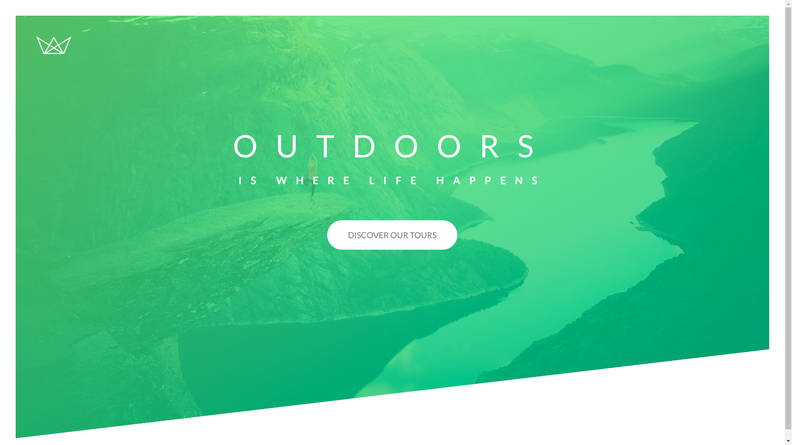

## Project Natours 

Esta é a reprodução do primeiro projeto do curso de **SASS** e **CSS avançado** do incrível <a href="https://github.com/jonasschmedtmann">Jonas Schmedtmann</a>!

Nele aprendemos sobre, dentre outras coisas:

- Sass
- CSS Grid
- Responsividade
- Animações

